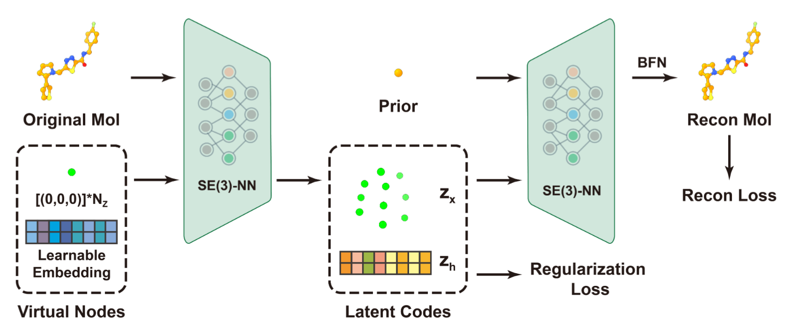

# MolFLAE — Manipulating 3D Molecules in a Fixed-Dimensional E(3)-Equivariant Latent Space

MolFLAE is a codebase for the paper "Manipulating 3D Molecules in a Fixed-Dimensional E(3)-Equivariant Latent Space" (NeurIPS 2025).



Current release
--------------------------
This release provides code and scripts for latent-space experiments under `Latent_Experiments/`.

Training code and support for GEOM-Drugs and QM9 datasets will be released in a follow-up update.

Quick links
-----------
- Latent-space experiments: `Latent_Experiments/latent_experiment`
- Model implementation: `Latent_Experiments/model`
- Instructions for running latent-space experiments: `Latent_Experiments/README.md`
- Environment spec: `environment.yaml`

Setup
-----
Create a conda environment (recommended):

```bash
conda env create -f environment.yaml
conda activate MolFLAE
```

Note: RDKit and OpenBabel are used in the repo and are included in the environment file; ensure they are available. Schrodinger utilities (used for some molecule repairs) are not included and are optional.

Contact
-------
For questions, please open an issue on this repository or contact the authors listed in the NeurIPS paper.

Paper citation
----------------
If you use this work, please cite:

```
@inproceedings{chen2025manipulating,
title={Manipulating 3D Molecules in a Fixed-Dimensional E(3)-Equivariant Latent Space},
author={Zitao Chen and Yinjun Jia and Zitong Tian and Wei-Ying Ma and Yanyan Lan},
booktitle={The Thirty-ninth Annual Conference on Neural Information Processing Systems},
year={2025},
url={https://openreview.net/forum?id=6xL4MRFeJo}
}
```